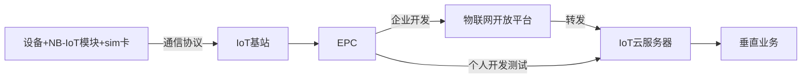

##  网络架构

## 物联网
|物联网类型|代表技术|特点|
|-|-|-|
|WLAN物联网|WI-FI、Bluetooth4.0、Zigbee、Z-wave|短距离通讯|
|蜂窝物联网|NB-IoT、eMTC、LoRa、Sigfox|远距离传输，低功耗|

## 蜂窝物联网

### 特点
覆盖广，连接数多，低功耗，低成本

### 蜂窝技术标准
> 3GPP (Third Generation Partnership Project，第三代合作伙伴计划）全球的通信技术协会
> Cat 是Category的意思

2016年6月 全球化3GPP组织定制了两个技术标准

|标准|代表|特点|应用场景|
|-|-|-|-|
|Cat-M1|eMTC|低中高速移动，速率高，支持语音，100ms级别时延，可定位|智能物流，可穿戴设备，智能追踪|
|Cat-NB1|NB-IoT|低速移动，秒级时延，不支持语音，模组成本低，覆盖广|环境监测，小区，停车场|

<Strong>现状：国内的三大运营商认准了NB-IoT，对于eMTC国内运营商没有牌照，目前中国移动持观望态度，经华为基于NB-IoT研究测试表明，在车速为80-120km/h，可以满足车辆定位和车载跟踪</Strong>

## NB-IOT芯片
|芯片商|芯片型号|特点|
|-|-|-|
|华为海思(华为子公司)|Boudica 120/Hi2110|国内最大的NB-IoT芯片原厂，搭载Huawei LiteOS嵌入式物联网操作系统|
|美国高通|MDM9206|同时支持Cat-M1和Cat-NB1 LTE的全球所有频段，eMTC/NB-IoT/GSM多模支持，自带卫星定位|
|中兴微电子|RoseFinch7100（中文名“朱雀”）|专为低功耗物联网而设计，在睡眠功耗、截止电压和外围接口数量等与物联网应用关联的核心指标上都在业界处于领先水平|

## NB-IOT模组厂商
<table>
	<tr>
		<th>厂商</th>
		<th>产品</th>
		<th>特点</th>
	</tr>
	<tr>
    <td rowspan="5" style="vertical-align: middle;">中移物联(中国移动)</td>
    <td>N10SG</td>
    <td>卫星定位等能力特征 ，-40℃~85℃</td>
	</tr>
	<tr>
		<td>GSM M5313</td>
		<td>支持 NB-loT 及 GSM 两种网络模式，M2M芯片，超小尺寸 -40℃~85℃</td>
	</tr>
	<tr>
		<td>M5312</td>
		<td>通用模组，同类产品最小尺寸 -40℃~85℃</td>
	</tr>
	<tr>
		<td>M5311</td>
		<td>通用模组， 支持 AA 干电池 -40℃~85℃</td>
	</tr>
	<tr>
		<td>M5310</td>
		<td>M2M芯片 支持最新 Release14 标准，支持更高通信速率 支持基站定位 -40℃~85℃</td>
	</tr>
</table>

***

|厂商|模组型号|芯片|价格|官网|
|-|-|-|-|-|
|上海移远通信技|BC95-B20/B8/B5/B28（采用华为芯片）|20元/个|http://www.quectel.com/cn/||
|上海移柯通信技术|L700|高通MDM9206|http://www.mobiletek.cn/||
|深圳市有方科技|N20|高通MDM9206|http://www.neoway.com/||
|中移物联网|M5310|华为海思Hi2110|http://iot.10086.cn/||
|深圳市美格智能技术|SLM150|华为海思Hi2110|http://www.meigchina.com/||

## 远程传输协议 

|协议名称|协议特点| 优点 |
|-|-|-|
|CoAP|基于 UDP 和 DTLS 加密接入  适用于设备纯数据上报场景，对资源的消耗和要求更低|轻量化 最小长度4B|
|MQTT|基于 TCP 和 TLS 加密接入 适用于设备间消息通信，或需要收取反向控制信令、配置场景|异步发布/订阅  发送的最大消息长度是256MB|
|LwM2M|基于REST架构 协议的消息传递是通过CoAP协议来达成, 协议实体分为客户端和服务端|轻量化 数据模型具有扩展性|

## 蜂窝网络选取和基站信号

目前以 <Strong>山西大同</Strong> 为准

|运营商|覆盖范围|资费|
|-|-|
|移动||
|电信||

## 物联网开放平台

### 接入物联网平台的优点
- 多语言的SDK,可以直接集成到设备端,调用sdk接入物联网平台
- 可以管理海量设备
- 自带时序数据库
- 消息队列储存,可以推送到企业服务器 (需要单独购买)
- 设备诊断
- 日志分析
- 数据展示

### 物联网开放平台对比
|平台|地域(数据中心位置)|配置|价格|官网|
|-|-|-|-|-|
|阿里云物联网平台企业版|上海\|深圳\|北京|企业实例 40G云盘 1年|6,674.40|https://iot.aliyun.com/|
|华为云物联网平台||||https://developer.huaweicloud.com/techfield/iot.html|
|中国移动物联网开放平台||||https://open.iot.10086.cn/|
|中国电信物联网开放平台||||https://www.ctwing.cn/|

##  云服务器 

作用：用来运行垂直业务服务,数据展示,数据查询

### 服务器价格对比

|服务器| 规格|配置 |参考价格|
|-|-|-|-|
|阿里云|ecs.c6.large| 2核4G内存40G硬盘 3年 1M宽带|4,588.02|
|腾讯云|S5.MEDIUM4|2核4G内存 50G 3年 1M宽带|2,824.20|
|华为云|c6.large.2| 2核4G内存40G硬盘 3年 1M宽带|4,128.00|
|百度云|bcc.c4.c2m4| 2核4G内存40G硬盘 3年 1M宽带|3,477.96|

